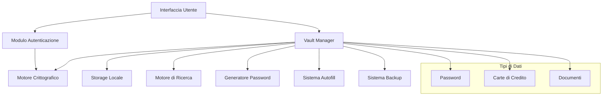
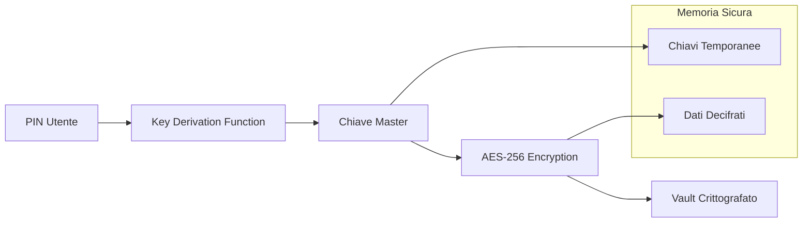
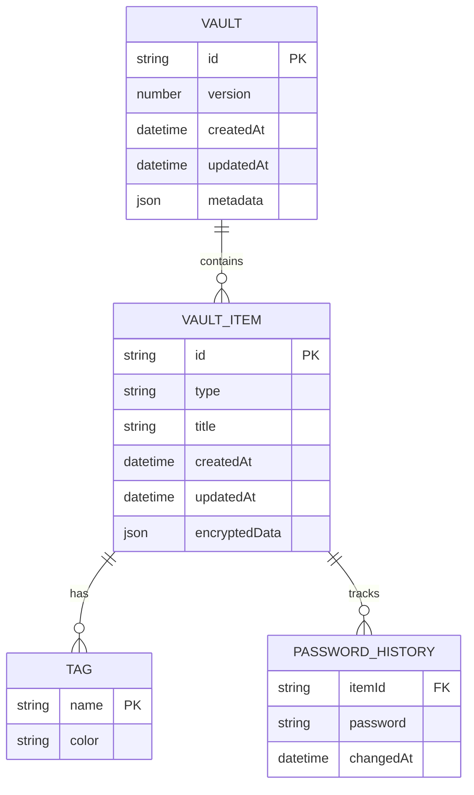

# Documento di Design - Password Manager App

## Panoramica

L'applicazione Password Manager è un sistema di gestione sicura multi-piattaforma (mobile e web) che implementa crittografia locale end-to-end per proteggere password, carte di credito e documenti personali. Il sistema è progettato con un'architettura a vault crittografato che garantisce che tutti i dati sensibili rimangano esclusivamente sul dispositivo dell'utente.

### Principi di Design

- **Security by Design**: Crittografia AES-256 con chiavi derivate localmente
- **Zero-Knowledge**: Nessun dato sensibile lascia mai il dispositivo
- **Cross-Platform**: Interfacce native per mobile e web con sincronizzazione sicura
- **User Experience**: Interfaccia intuitiva con compilazione automatica
- **Privacy First**: Protezione contro screenshot, debug e reverse engineering

## Architettura

### Architettura di Alto Livello



### Architettura di Sicurezza



## Componenti e Interfacce

### 1. Modulo Autenticazione

**Responsabilità:**
- Gestione del PIN numerico (4-8 cifre)
- Derivazione della chiave master usando PBKDF2
- Gestione dei tentativi falliti e blocco temporaneo
- Auto-lock dopo inattività

**Interfacce:**
```typescript
interface AuthenticationService {
  authenticate(pin: string): Promise<AuthResult>
  deriveMasterKey(pin: string, salt: Uint8Array): Promise<CryptoKey>
  lockVault(): void
  isLocked(): boolean
  getFailedAttempts(): number
  getRemainingLockTime(): number
}

interface AuthResult {
  success: boolean
  masterKey?: CryptoKey
  error?: AuthError
}
```

### 2. Motore Crittografico

**Responsabilità:**
- Crittografia/decrittografia AES-256-GCM
- Generazione di salt e IV casuali
- Gestione sicura delle chiavi in memoria
- Cancellazione sicura dei dati sensibili

**Interfacce:**
```typescript
interface CryptoEngine {
  encrypt(data: Uint8Array, key: CryptoKey): Promise<EncryptedData>
  decrypt(encryptedData: EncryptedData, key: CryptoKey): Promise<Uint8Array>
  generateSalt(): Uint8Array
  generateIV(): Uint8Array
  secureWipe(data: Uint8Array): void
}

interface EncryptedData {
  ciphertext: Uint8Array
  iv: Uint8Array
  authTag: Uint8Array
}
```

### 3. Vault Manager

**Responsabilità:**
- Gestione del vault crittografato
- CRUD operations per tutti i tipi di elementi
- Indicizzazione e ricerca
- Validazione dei dati

**Interfacce:**
```typescript
interface VaultManager {
  createVault(masterKey: CryptoKey): Promise<void>
  loadVault(masterKey: CryptoKey): Promise<Vault>
  saveVault(vault: Vault, masterKey: CryptoKey): Promise<void>
  addItem(item: VaultItem): Promise<string>
  updateItem(id: string, item: VaultItem): Promise<void>
  deleteItem(id: string): Promise<void>
  searchItems(query: SearchQuery): Promise<VaultItem[]>
}

interface Vault {
  id: string
  version: number
  createdAt: Date
  updatedAt: Date
  items: Map<string, VaultItem>
  metadata: VaultMetadata
}
```

### 4. Tipi di Dati

**Password:**
```typescript
interface PasswordItem extends VaultItem {
  type: 'password'
  title: string
  username: string
  password: string
  url?: string
  notes?: string
  history: PasswordHistory[]
  tags: string[]
}

interface PasswordHistory {
  password: string
  changedAt: Date
}
```

**Carta di Credito:**
```typescript
interface CreditCardItem extends VaultItem {
  type: 'creditcard'
  title: string
  cardNumber: string
  holderName: string
  expiryDate: string
  cvv: string
  notes?: string
  tags: string[]
}
```

**Documento:**
```typescript
interface DocumentItem extends VaultItem {
  type: 'document'
  title: string
  content: DocumentContent
  tags: string[]
  notes?: string
}

interface DocumentContent {
  type: 'text' | 'image' | 'pdf'
  data: Uint8Array
  mimeType: string
  size: number
}
```

### 5. Generatore Password

**Responsabilità:**
- Generazione di password sicure e casuali
- Configurazione di lunghezza e set di caratteri
- Validazione della forza della password

**Interfacce:**
```typescript
interface PasswordGenerator {
  generate(options: GeneratorOptions): string
  calculateStrength(password: string): PasswordStrength
  validateOptions(options: GeneratorOptions): boolean
}

interface GeneratorOptions {
  length: number // 8-64
  includeUppercase: boolean
  includeLowercase: boolean
  includeNumbers: boolean
  includeSymbols: boolean
  excludeSimilar: boolean
  excludeAmbiguous: boolean
}
```

### 6. Sistema Autofill

**Responsabilità:**
- Riconoscimento automatico dei siti web
- Integrazione con il sistema autofill nativo
- Compilazione sicura dei campi
- Gestione degli appunti con auto-cancellazione

**Interfacce:**
```typescript
interface AutofillService {
  detectWebsite(url: string): Promise<WebsiteMatch[]>
  fillCredentials(item: PasswordItem, target: FillTarget): Promise<void>
  copyToClipboard(text: string, autoWipe: boolean): Promise<void>
  integrateWithNativeAutofill(): Promise<void>
}

interface WebsiteMatch {
  item: PasswordItem
  confidence: number
  exactMatch: boolean
}
```

## Modelli Dati

### Schema del Vault



### Struttura di Storage

```
/vault/
├── vault.json (metadati crittografati)
├── items/
│   ├── {item-id}.json (dati elemento crittografati)
│   └── ...
├── documents/
│   ├── {doc-id}.enc (file documento crittografato)
│   └── ...
├── backups/
│   ├── backup-{timestamp}.vault
│   └── ...
└── config/
    ├── settings.json
    └── index.json (indice di ricerca crittografato)
```

## Proprietà di Correttezza

*Una proprietà è una caratteristica o comportamento che dovrebbe essere vero in tutte le esecuzioni valide di un sistema - essenzialmente, una dichiarazione formale su ciò che il sistema dovrebbe fare. Le proprietà servono come ponte tra le specifiche leggibili dall'uomo e le garanzie di correttezza verificabili dalla macchina.*

### Proprietà 1: Round-trip Crittografico
*Per qualsiasi* dato sensibile e chiave master valida, cifrare e poi decifrare dovrebbe produrre il dato originale identico
**Valida: Requisiti 1.2, 4.2, 5.3, 8.2**

### Proprietà 2: Generazione Chiavi Sicure
*Per qualsiasi* PIN valido (4-8 cifre), il sistema dovrebbe sempre generare una chiave AES-256 valida usando PBKDF2
**Valida: Requisiti 1.1**

### Proprietà 3: Blocco dopo Tentativi Falliti
*Per qualsiasi* sequenza di 5 PIN errati consecutivi, il sistema dovrebbe bloccare l'accesso per almeno 30 minuti
**Valida: Requisiti 1.3**

### Proprietà 4: Invariante Crittografia Dati
*Per tutti* i dati salvati sul dispositivo, devono essere in formato crittografato prima della persistenza
**Valida: Requisiti 1.4, 5.4, 8.1**

### Proprietà 5: Auto-lock Temporale
*Per qualsiasi* periodo di inattività superiore a 5 minuti, il vault dovrebbe essere automaticamente bloccato
**Valida: Requisiti 1.5**

### Proprietà 6: Completezza Campi Obbligatori
*Per qualsiasi* elemento aggiunto (password o carta di credito), tutti i campi obbligatori devono essere presenti e non vuoti
**Valida: Requisiti 2.1, 3.1**

### Proprietà 7: Ricerca Universale
*Per qualsiasi* query di ricerca che corrisponde a titolo, username, URL, contenuto o tag di un elemento, quell'elemento dovrebbe apparire nei risultati
**Valida: Requisiti 2.2, 4.5**

### Proprietà 8: Configurazione Generatore Password
*Per qualsiasi* configurazione valida del generatore (lunghezza 8-64, set di caratteri), la password generata dovrebbe rispettare esattamente quella configurazione
**Valida: Requisiti 2.3, 2.4**

### Proprietà 9: Invariante Storico Password
*Per qualsiasi* password modificata, lo storico non dovrebbe mai contenere più di 5 versioni precedenti
**Valida: Requisiti 2.5**

### Proprietà 10: Mascheramento Numero Carta
*Per qualsiasi* numero di carta di credito visualizzato, dovrebbe mostrare solo le ultime 4 cifre con il resto mascherato
**Valida: Requisiti 3.2**

### Proprietà 11: Autenticazione Visualizzazione Completa
*Per qualsiasi* richiesta di visualizzazione completa di dati sensibili, il sistema dovrebbe richiedere nuovamente l'autenticazione PIN
**Valida: Requisiti 3.3**

### Proprietà 12: Validazione Algoritmo Luhn
*Per qualsiasi* numero di carta di credito accettato dal sistema, dovrebbe passare la validazione dell'algoritmo di Luhn
**Valida: Requisiti 3.4**

### Proprietà 13: Avviso Scadenza Carta
*Per qualsiasi* carta di credito con data di scadenza entro 30 giorni, il sistema dovrebbe mostrare un avviso di scadenza
**Valida: Requisiti 3.5**

### Proprietà 14: Validazione Formato e Dimensione File
*Per qualsiasi* file caricato, dovrebbe essere accettato solo se è di tipo supportato (testo, JPG, PNG, PDF) e sotto 10MB
**Valida: Requisiti 4.1, 4.3**

### Proprietà 15: Organizzazione tramite Tag
*Per qualsiasi* documento con tag assegnati, dovrebbe essere recuperabile tramite ricerca per quei tag
**Valida: Requisiti 4.4**

### Proprietà 16: Riconoscimento URL Autofill
*Per qualsiasi* URL salvato nel vault, il sistema dovrebbe riconoscerlo e suggerire le credenziali appropriate quando visitato
**Valida: Requisiti 6.1**

### Proprietà 17: Correttezza Compilazione Automatica
*Per qualsiasi* compilazione automatica confermata, i dati inseriti nei campi dovrebbero corrispondere esattamente a quelli salvati nel vault
**Valida: Requisiti 6.2**

### Proprietà 18: Auto-cancellazione Appunti
*Per qualsiasi* dato copiato negli appunti dal sistema, dovrebbe essere automaticamente cancellato dopo esattamente 30 secondi
**Valida: Requisiti 6.4**

### Proprietà 19: Gestione Credenziali Duplicate
*Per qualsiasi* sito con credenziali multiple salvate, il sistema dovrebbe permettere all'utente di scegliere quale utilizzare
**Valida: Requisiti 6.5**

### Proprietà 20: Sicurezza Locale Completa
*Per tutte* le operazioni crittografiche, devono essere eseguite localmente senza trasmissione di dati sensibili non crittografati
**Valida: Requisiti 7.1, 7.5**

### Proprietà 21: Completezza Backup
*Per qualsiasi* operazione di backup, il file risultante dovrebbe contenere tutti i dati del vault e i metadati richiesti (versione, data)
**Valida: Requisiti 8.1, 8.4**

### Proprietà 22: Scheduling Backup Automatici
*Per qualsiasi* configurazione di backup automatico (giornaliero, settimanale, mensile), i backup dovrebbero essere creati secondo la programmazione specificata
**Valida: Requisiti 8.3**

### Proprietà 23: Invariante Gestione Versioni Backup
*Per qualsiasi* sistema di backup, non dovrebbero mai esistere più di 10 backup contemporaneamente
**Valida: Requisiti 8.5**

## Gestione degli Errori

### Strategie di Gestione Errori

1. **Errori di Crittografia**
   - Chiavi corrotte o non valide → Richiesta re-autenticazione
   - Dati corrotti → Tentativo di ripristino da backup
   - Fallimento operazioni crittografiche → Log sicuro e notifica utente

2. **Errori di Autenticazione**
   - PIN errato → Incremento contatore tentativi
   - Troppi tentativi → Blocco temporaneo con backoff esponenziale
   - Timeout sessione → Auto-lock immediato

3. **Errori di Storage**
   - Spazio insufficiente → Notifica e suggerimento pulizia
   - Corruzione file → Tentativo ripristino da backup
   - Permessi negati → Richiesta autorizzazioni utente

4. **Errori di Validazione**
   - Dati non validi → Messaggio specifico e suggerimenti correzione
   - Formato file non supportato → Lista formati supportati
   - Dimensione file eccessiva → Limite massimo e suggerimenti riduzione

### Codici di Errore

```typescript
enum ErrorCode {
  // Autenticazione
  INVALID_PIN = 'AUTH_001',
  TOO_MANY_ATTEMPTS = 'AUTH_002',
  SESSION_EXPIRED = 'AUTH_003',
  
  // Crittografia
  ENCRYPTION_FAILED = 'CRYPTO_001',
  DECRYPTION_FAILED = 'CRYPTO_002',
  KEY_DERIVATION_FAILED = 'CRYPTO_003',
  
  // Storage
  STORAGE_FULL = 'STORAGE_001',
  FILE_CORRUPTED = 'STORAGE_002',
  PERMISSION_DENIED = 'STORAGE_003',
  
  // Validazione
  INVALID_DATA_FORMAT = 'VALIDATION_001',
  FILE_TOO_LARGE = 'VALIDATION_002',
  UNSUPPORTED_FILE_TYPE = 'VALIDATION_003'
}
```

## Strategia di Testing

### Approccio Dual Testing

Il sistema utilizzerà un approccio di testing duale che combina:

- **Test Unitari**: Verificano esempi specifici, casi limite e condizioni di errore
- **Test Property-Based**: Verificano proprietà universali su tutti gli input possibili

Entrambi sono complementari e necessari per una copertura completa:
- I test unitari catturano bug concreti e casi specifici
- I test property-based verificano la correttezza generale attraverso randomizzazione

### Configurazione Property-Based Testing

**Libreria**: Utilizzeremo **fast-check** per JavaScript/TypeScript per i test property-based
- Minimo 100 iterazioni per test property (a causa della randomizzazione)
- Ogni test property deve referenziare la sua proprietà del documento di design
- Formato tag: **Feature: password-manager-app, Property {numero}: {testo proprietà}**
- Ogni proprietà di correttezza DEVE essere implementata da un SINGOLO test property-based

### Bilanciamento Test Unitari

I test unitari sono utili per esempi specifici e casi limite:
- **Focus su**: Esempi specifici che dimostrano comportamento corretto
- **Focus su**: Punti di integrazione tra componenti  
- **Focus su**: Casi limite e condizioni di errore
- **Evitare**: Troppi test unitari - i test property-based gestiscono la copertura di molti input

### Esempi di Test Strategy

**Test Property-Based**:
```typescript
// Feature: password-manager-app, Property 1: Round-trip Crittografico
test('encryption-decryption preserves data', () => {
  fc.assert(fc.property(
    fc.uint8Array(),
    fc.string(),
    (data, pin) => {
      const key = deriveMasterKey(pin);
      const encrypted = encrypt(data, key);
      const decrypted = decrypt(encrypted, key);
      expect(decrypted).toEqual(data);
    }
  ), { numRuns: 100 });
});
```

**Test Unitari**:
```typescript
// Test specifico per caso limite
test('empty password should be rejected', () => {
  expect(() => addPassword('', 'user', 'pass')).toThrow();
});

// Test integrazione
test('vault manager integrates with crypto engine', () => {
  const vault = new VaultManager(cryptoEngine);
  expect(vault.isReady()).toBe(true);
});
```

### Coverage Requirements

- **Property Tests**: Ogni proprietà di correttezza deve avere un test property-based corrispondente
- **Unit Tests**: Almeno un test unitario per ogni metodo pubblico
- **Integration Tests**: Test per ogni interfaccia tra componenti principali
- **Error Tests**: Test per ogni codice di errore definito